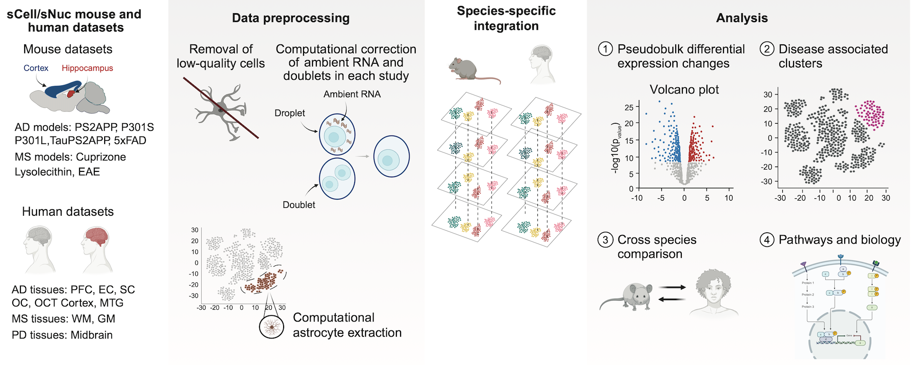

# Astrocyte Atlas

This repository contains the computational analysis code for the manuscript "Integrated Cross-Disease Atlas of Human And Mouse Astrocytes Reveals Heterogeneity and Conservation of Astrocyte Subtypes in Neurodegeneration‬" currently available as a preprint on bioRxiv.

## 📖 Study Overview

This study presents a comprehensive meta-analysis of astrocyte populations across multiple neurodegenerative diseases using single-cell RNA sequencing data. We identified disease-associated astrocyte (DAA) subtypes and characterized their molecular signatures, spatial distributions, and functional roles in Alzheimer's Disease (AD), Multiple Sclerosis (MS), and Parkinson's Disease (PD).

 \### Key Findings

-   Identification of distinct disease-associated astrocyte subtypes (DAA1 and DAA2)
-   Cross-species validation using mouse models and human post-mortem tissue
-   Spatial analysis showing DAA proximity to amyloid plaques in mice
-   Analysis showing human DAA enrichment in MS lesions
-   Functional pathway analysis revealing disease-specific astrocyte responses

## 🔗 Links

-   **Preprint**: [bioRxiv](https://www.biorxiv.org/content/10.1101/2025.02.12.637903v1)
-   Static Data Exploration: <http://research-pub.gene.com/AstroAtlas/>
-   **Interactive Shiny Applications**:
    -   [Human](https://tawaunl.shinyapps.io/HumanGeneScore_Downsampled/)
    -   [Mouse](https://tawaunl.shinyapps.io/MouseGeneScore_Astro/)

## 📁 Repository Structure

```         
├── AnalysisScripts
├── FigureScripts
|   ├── Figure1.R       # Mouse disease volcano plots and pathway analysis
|   ├── Figure2.R       # Mouse astrocyte clustering and marker analysis  
|   ├── Figure3.R       # Mouse DAA1 vs DAA2 comparison and LPS validation
|   ├── Figure4.R       # Mouse spatial analysis of astrocyte subtypes
|   ├── Figure5.R       # Human astrocyte clustering analysis
|   ├── Figure6.R       # Human disease comparisons (AD/MS/PD)
|   ├── Figure7.R       # Human cluster 2 subanalysis
|   ├── Figure8.R
│   └──Supplemental
├── README.md           # This file
├── shiny               # web applications to explore data
└── utils/
    └── scHelpers.R     # Custom helper functions
```

## 🛠️ Environment Setup

### R Version and Dependencies

This analysis requires R version 4.0 or higher. Install the required packages using:

``` r
# Bioconductor packages
if (!require("BiocManager", quietly = TRUE))
    install.packages("BiocManager")

BiocManager::install(c(
    "Seurat",
    "SingleCellExperiment", 
    "scran.chan",
    "scuttle",
    "edgeR",
    "clusterProfiler",
    "org.Mm.eg.db",
    "org.Hs.eg.db",
    "scDblFinder",
    "batchelor",
    "scater"
))

# CRAN packages
install.packages(c(
    "ggplot2",
    "wesanderson", 
    "tidyverse",
    "ggdendro",
    "cowplot",
    "ggtree",
    "patchwork",
    "scales",
    "ggrepel",
    "viridis",
    "RColorBrewer", 
    "gridExtra",
    "ggpubr",
    "rstatix",
    "networkD3",
    "ggrastr",
    "extrafont"
))

# Additional packages
remotes::install_github("GuangchuangYu/GOSemSim")
devtools::install_github("YuLab-SMU/clusterProfiler")
```

### Required Helper Functions

The analysis depends on custom helper functions in `scHelpers.R`. Ensure this file is sourced at the beginning of each script:

``` r
source("./scHelpers.R")
```

## 📊 Data Access

### Data Location

The processed count datasets can be found on [Zenodo](https://zenodo.org/records/15272230/)

Use the associated counts and metadata to create SCE/Seurat objects. Name them accordingly.

### Data Requirements

Due to file size limitations, the raw data files are not included in this repository. To reproduce the analysis:

1.  Download counts and metadata from Zenodo
2.  Create Seurat objects with counts and metadata. and save.
3.  Update file paths/names in scripts if using a different directory structure

## 🔬 Analysis Workflow

### Figure Generation

Each figure script is self-contained and generates specific analyses:

1.  **Figure 1**: Mouse disease-specific differential expression analysis
2.  **Figure 2**: Mouse astrocyte subtype identification and characterization
3.  **Figure 3**: Mouse DAA1 vs DAA2 comparison and experimental validation
4.  **Figure 4**: Spatial relationship analysis
5.  **Figure 5**: Human astrocyte clustering
6.  **Figure 6**: Cross-disease human analysis
7.  **Figure 7**: Detailed human subcluster analysis
8.  Figure 8: Cross species comparisons

### Running the Analysis

``` r
# Set working directory
setwd("path/to/repository")

# Source helper functions
source("scHelpers.R")

# Run individual figure scripts
source("Figure1.R")
source("Figure2.R")
# ... continue for other figures
```

## 📈 Key Analysis Methods

### Clustering and Integration

-   **Seurat v4** for single-cell analysis
-   **Harmony** for batch correction in human data
-   **SCVI** coordinates for mouse data visualization

### Differential Expression

-   **edgeR** for pseudo-bulk differential expression
-   **Meta-analysis** approaches for cross-study comparisons
-   **Bonferroni correction** for multiple testing

### Pathway Analysis

-   **clusterProfiler** for GO and KEGG enrichment
-   **Gene Set Enrichment Analysis (GSEA)**
-   **Comparative pathway analysis** across diseases

### Statistical Testing

-   **Wilcoxon rank-sum tests** for group comparisons
-   **Kruskal-Wallis tests** for multi-group analysis
-   **Centered Log-Ratio (CLR) transformation** for compositional data

## 🎨 Visualization

The analysis generates publication-ready figures using: - **ggplot2** for most visualizations - **Cairo PDF** for high-quality vector graphics - **Custom color palettes** for consistent theming - **ggrepel** for intelligent label placement

## 📋 System Requirements

-   **Operating System**: Linux/macOS/Windows
-   **RAM**: Minimum 16GB recommended (32GB+ for large datasets)
-   **Storage**: \~50GB for all datasets
-   **R Version**: 4.0+
-   **Additional**: Cairo graphics library for PDF generation

## 🤝 Contributing

This repository contains the analysis code for a specific publication. For questions about the analysis or requests for collaboration:

1.  Open an issue for technical questions
2.  Contact the corresponding author for data access requests
3.  See the manuscript for detailed methodology

## 📄 Citation

If you use this code or data, please cite:

```         
@article {Lucas2025.02.12.637903,
    author = {Lucas, Tawaun A. and Novikova, Gloriia and Rao, Sadhna and Wang, Yuanyuan and Laufer, Benjamin I. and Pandey, Shristi. and Webb, Michelle. G. and Jorstad, Nikolas. and Friedman, Brad A. and Hanson, Jesse E. and Kaminker, Joshua S.},
    title = {Integrated Cross-Disease Atlas of Human And Mouse Astrocytes Reveals Heterogeneity and Conservation of Astrocyte Subtypes in Neurodegeneration},
    elocation-id = {2025.02.12.637903},
    year = {2025},
    doi = {10.1101/2025.02.12.637903}
```

## 📞 Contact

For questions regarding this analysis: - **Corresponding Authors**: [kaminker.josh\@gene.com](mailto:kaminker.josh@gene.com)
**Code Issues**: Open a GitHub issue - **Data Access**: Contact corresponding author
